# OpenDelivery

[English](README.md) | **简体中文**

OpenDelivery 是面向多机器人配送实验的 ROS 2 工作区，集成 Gazebo 仿真、SLAM 建图、定位、Nav2 导航和任务管理，并提供中英双语 Web 控制台，用于跨楼层地图的机器人监控与操作。

## 主要功能

- **建图与定位**：使用 `slam_toolbox` 建图，支持 Gazebo 仿真真值定位、激光定位和旧地图 AMCL 定位。
- **机器人任务**：支持点到点导航、巡逻、路径跟随，以及暂停、恢复、终止；展示各机器人的任务队列和状态，通过假电梯执行跨楼层任务。
- **Web 操作**：查看地图、机器人位姿、雷达和规划路径，地图选点导航、切图、重定位，以及键盘 / 按钮遥控。
- **地图编辑**：编辑占用栅格和语义图层，管理电梯内点、电梯等待点、待机点、自定义点和重定位点。
- **调试与回放**：查看 ROS 节点、机器人参数和 Gazebo 俯视相机，在浏览器中回放 bag，同步展示地图、相机、状态及可搜索的日志。
- **OpenClaw 助手**：通过聊天面板调用机器人操作 API，支持持久对话和会话管理；需要配置助手后端。

控制台可通过语言选择器切换英文和简体中文。当前跨层乘梯采用仿真电梯执行器。

## 配送演示

[播放配送演示](docs/videos/opendelivery-autonomous-delivery.mp4)（约 6 分钟，默认英文界面）：通过简短 OpenClaw 请求让 robot2 在一楼上线、取货，乘仿真电梯到四楼送达。视频展示控制台页面、完整助手反馈，最后以 2 倍速播放本轮任务的整个 bag；TXT 日志只展开 5 秒后收起。

[录制说明与验证](docs/videos/README.md)包含成功任务 ID 和回放检查结果。

## Web 功能预览

### OpenDelivery 整体展示

控制台集成楼层地图、语义区域、机器人位姿、雷达、规划路径、导航、重定位及遥控。下图展示 Gazebo 仿真中在线的 robot1，当前地图为 `test_103`。


### 任务运行过程

实际仿真导航任务展示任务 ID、`Navigating` 执行状态、工作队列和前往卧室的规划路径。

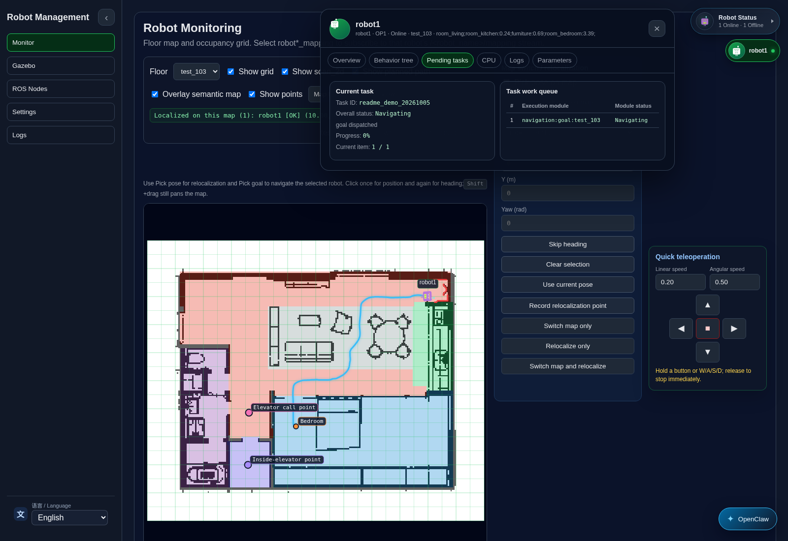

### 机器人状态悬浮框与详情

状态悬浮框列出在线 / 离线机器人、楼层地图、心跳状态和仿真操作；详情页进一步展示定位、任务状态、位姿、传感器数据、ROS 节点数量及关联进程。

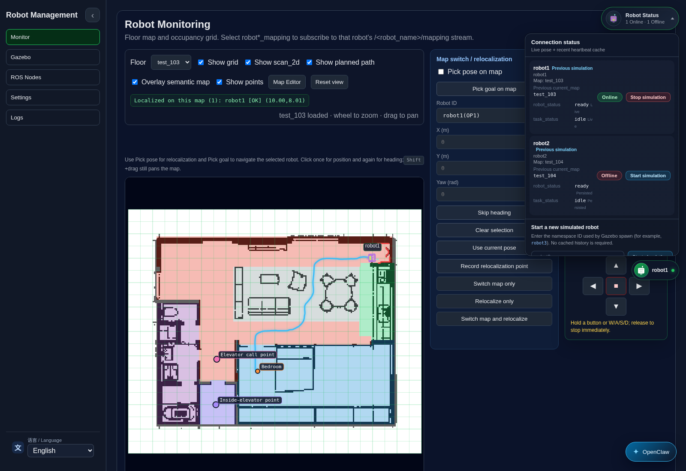

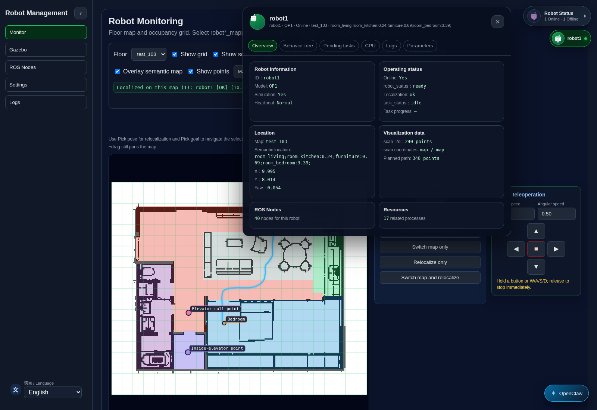

### 机器人行为树与 CPU / 内存

查看导航执行链路，以及该机器人关联进程和 ROS 节点的运行情况。

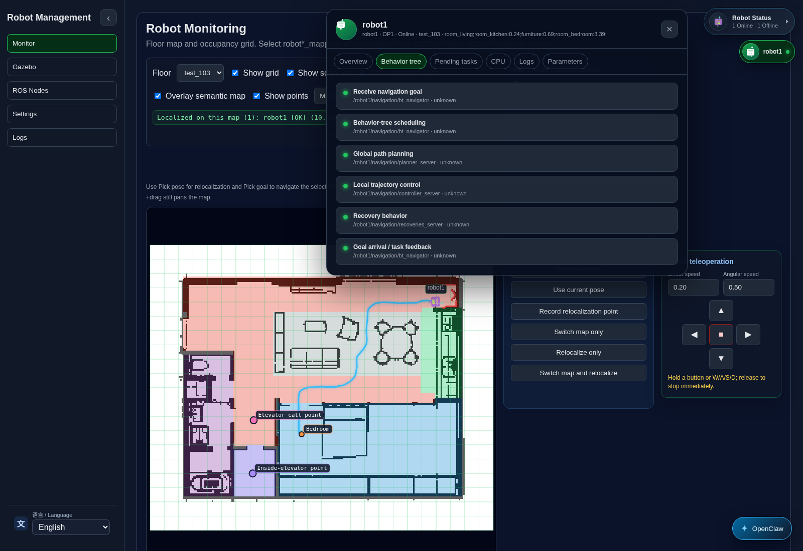

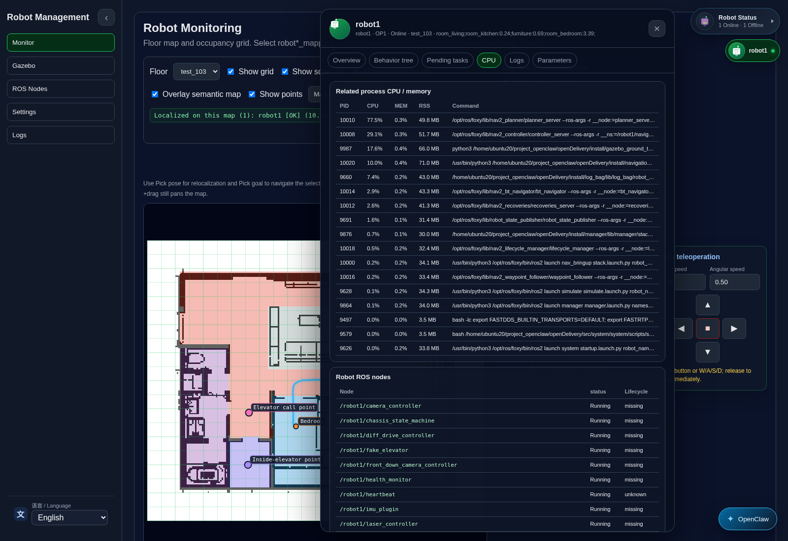

### Gazebo 仿真页面

通过实时俯视相机查看四个仿真区域、图像新鲜度和相机控制，并选择机器人定位坐标。

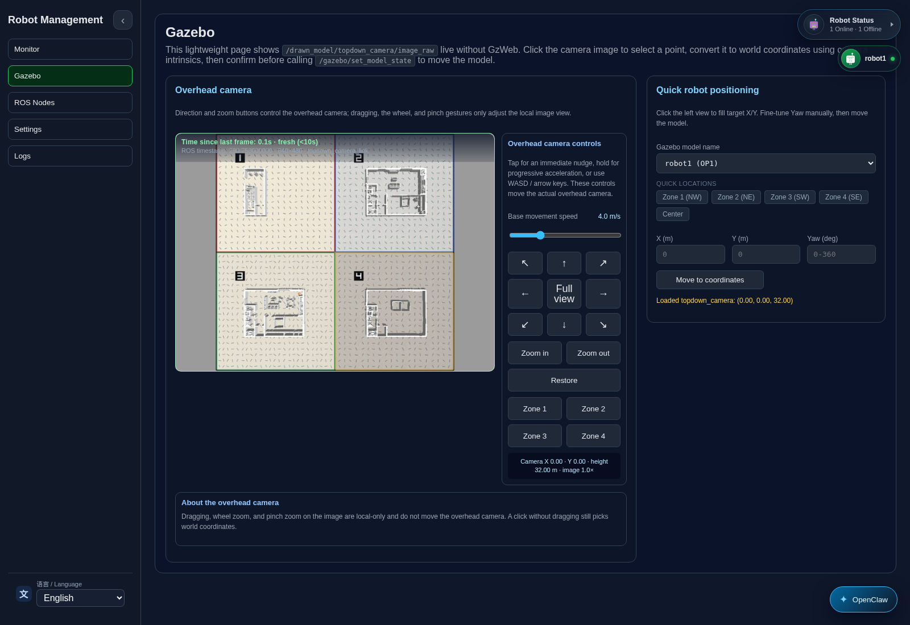

### ROS 节点页面

按机器人与子系统分组展示节点、运行状态及可用的生命周期操作。

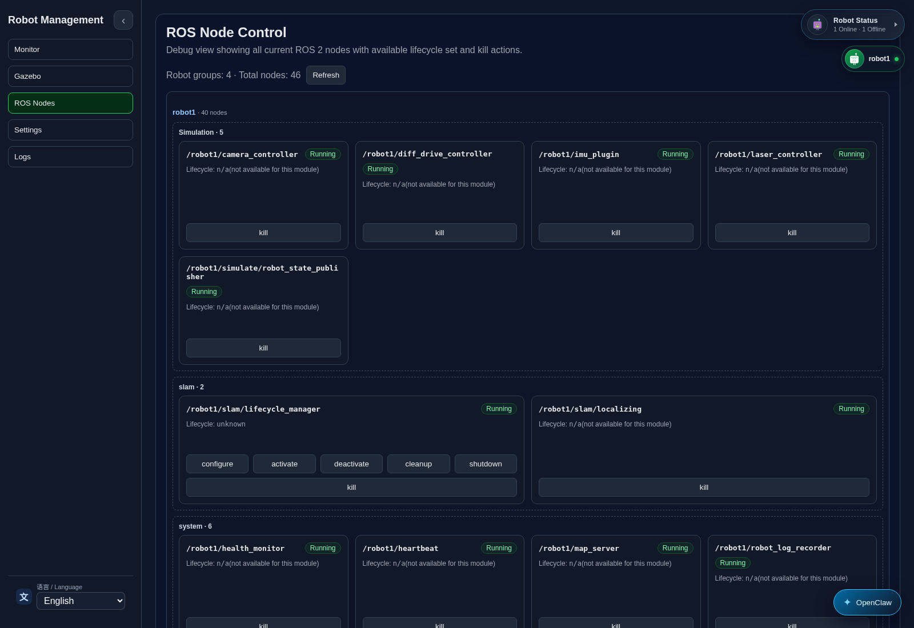

### Settings 页面与机器人参数

按机器人配置最大线速度、最大角速度及障碍膨胀半径，也可从机器人详情的参数页访问。

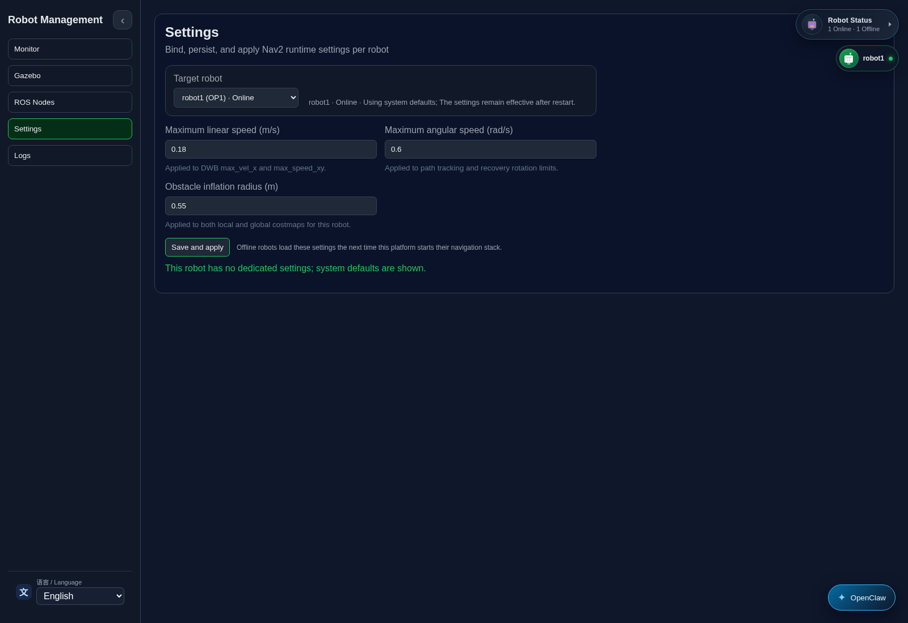

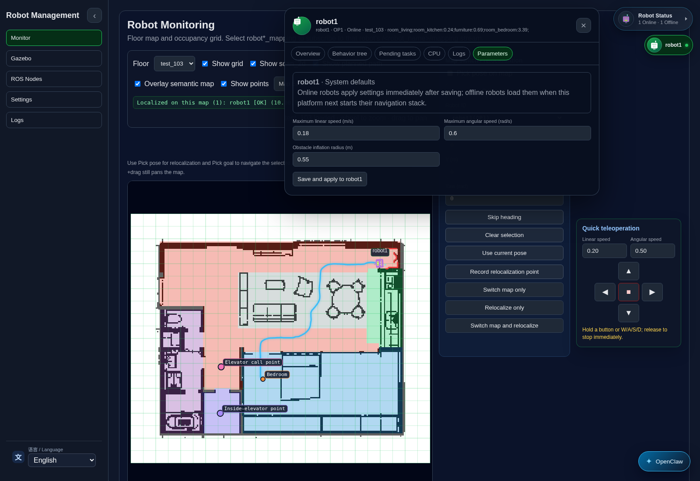

### 地图编辑器

在同一编辑器中修改栅格障碍、语义标签和命名点位，支持撤销与保存。

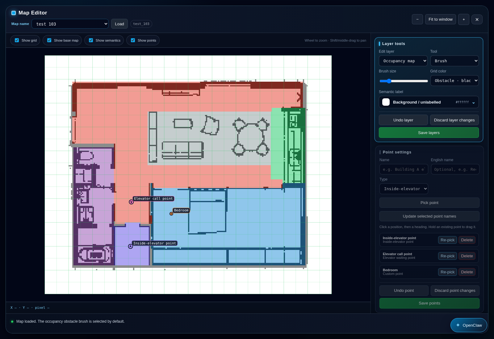

### 日志归档、播放画面与同步日志

浏览归档 bag 和任务标签，播放录制地图、机器人状态、雷达、路径及前视 / 下视相机画面。日志面板跟随播放进度，支持筛选与点击时间跳转。回放读取归档数据，不向 ROS 下发命令。

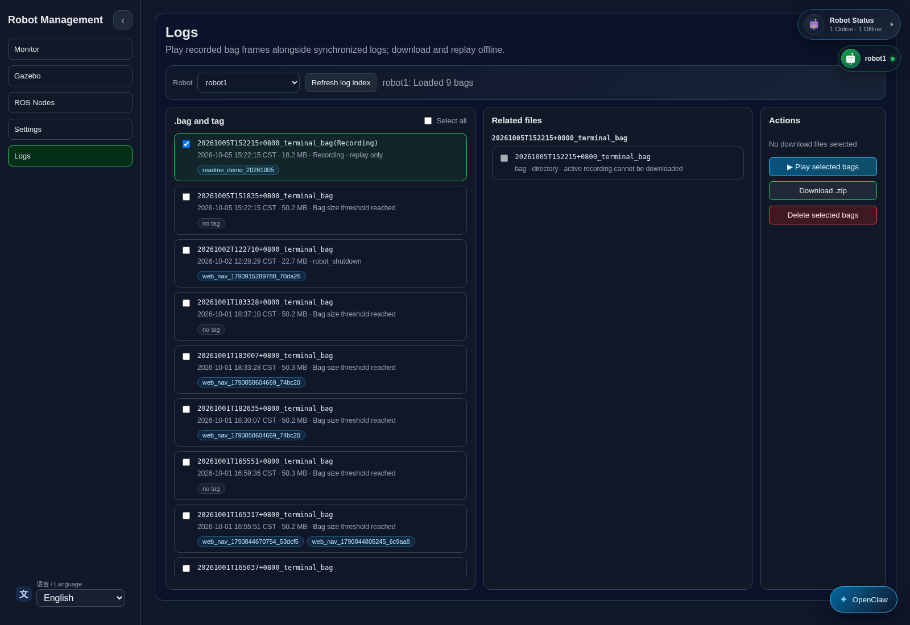

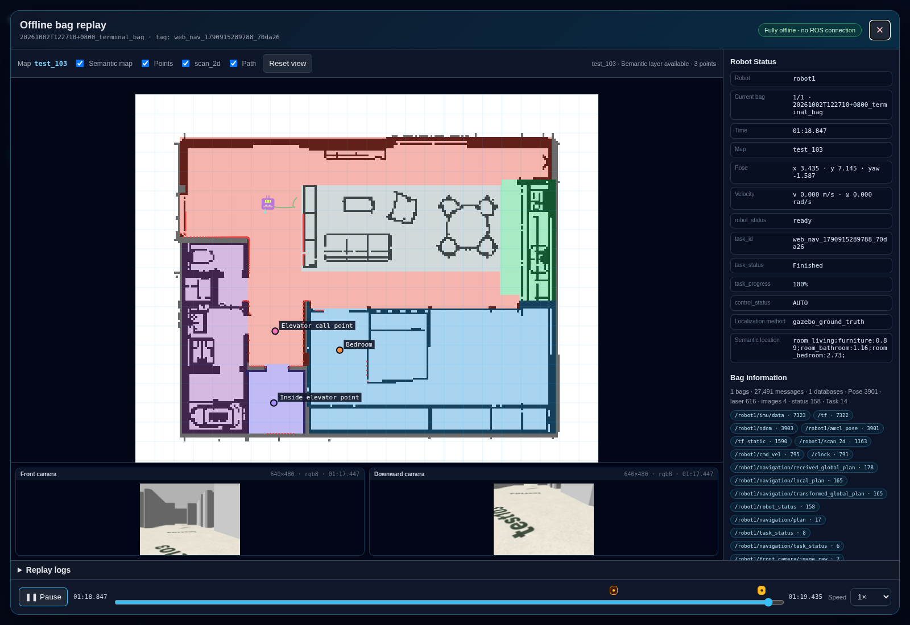

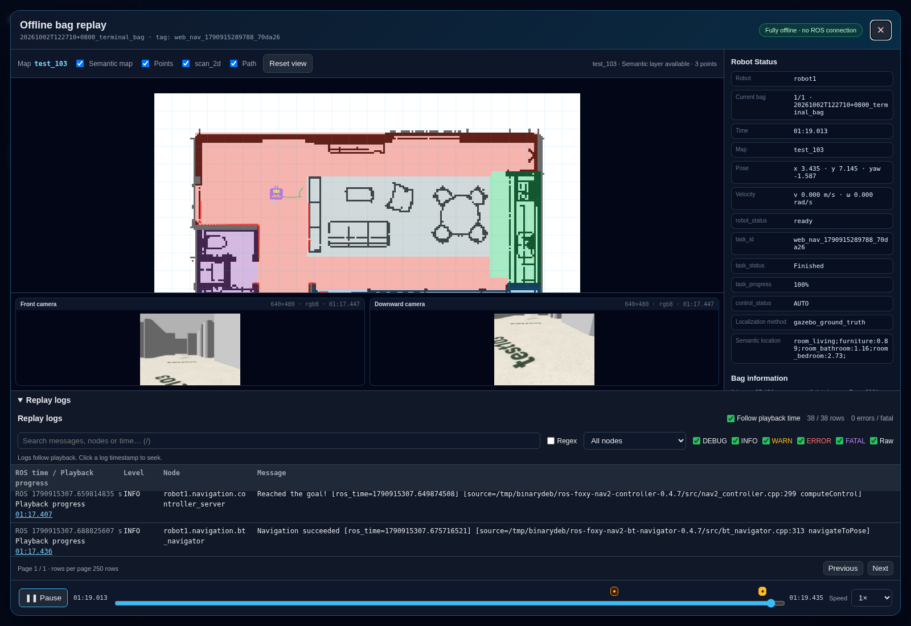

全部截图由脚本从实际控制台自动获取，两种语言文档共用英文截图。实时页面展示本地 Gazebo 仿真的 robot1；回放使用 robot1 的真实归档录制。

## 快速启动

准备 ROS 2 环境（本工作区面向 Foxy）、Gazebo、`slam_toolbox`、Nav2、`colcon` 和安装 Pillow 的 Python。构建与仿真步骤见 [ROS 工作区说明](src/README.md) 和 [技术说明](docs/technical-overview.zh-CN.md)。

```bash
cd /path/to/openDelivery
./start_web_stack.sh
```

控制台地址为 <http://localhost:8000>，API 地址为 <http://localhost:8001>。启动脚本加载 ROS / 工作区环境，必要时构建自定义消息及其使用方。本机仿真默认 `ROS_LOCALHOST_ONLY=1`；跨机器连接 ROS 节点时设置为 `0`。

## 自动更新截图

运行 Web / API 服务，并准备在线仿真机器人、Gazebo 实时相机、已保存地图及归档 bag。先启动导航任务，再执行脚本获取运行过程：

```bash
npm install -g agent-browser
agent-browser install
python3 scripts/capture_readme_screenshots.py --robot-id robot1 --require-running-task
```

脚本自动获取 14 个视图，默认使用英文，将 PNG 写入 `docs/images/`。用 `--only gazebo,ros-nodes,settings` 更新指定页面，用 `--bag <归档路径>` 选择包含相机画面的录制。不加 `--require-running-task` 时，任务页按当前实际状态截图。可用 `--url http://host:8000` 指定其他控制台；用 `--locale zh-CN --output /tmp/opendelivery-zh` 生成中文截图；已有 CLI 可通过 `AGENT_BROWSER_BIN` 指定路径。脚本读取实时状态并播放录制数据，不启动机器人、不下发任务，也不保存参数或地图。

## 更多文档

- [技术说明：架构、节点、定位和 Web 数据链路](docs/technical-overview.zh-CN.md)
- [ROS 功能包、构建与仿真](src/README.md)
- [HTTP API 契约](backend/API.md)
- [日志与回放](docs/logging.md)
- [助手会话与管理](docs/assistant-sessions.md)

源码位于 `src/`，Web 页面位于 `web/`，HTTP / ROS 桥位于 `backend/`。构建产物、地图、日志和 bag 不纳入 Git。
